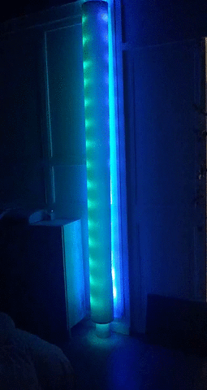
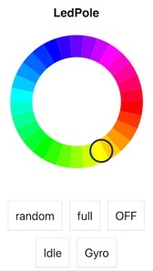

# LEDPole

Poteau composé de 15 bandeaux de 16 leds (=240) contrôlées individuellement via Arduino et WiFi.

Avec des exemples de code pour animer des bandeaux à base de LEDs WS2812b.

👌 Développé avec l'[extension PlatformIO pour VSCode ](https://docs.platformio.org/en/latest/ide/vscode.html)



## Hardware

- Leds : type [CHINLY WS2812B](https://www.amazon.com/CHINLY-Individually-Addressable-Waterproof-waterproof/dp/B01LSF4Q00)
- NodeMCU : type [NodeMCU/Arduino ESP8266 WiFi](https://hackspark.fr/fr/outils-de-dev/1063-nodemcu-amica-r2-lua-arduino-python-esp-12e-esp8266-wifi-32bit-mcu.html)
- Alim 5V
- Alim 12V

## Software

- Interface mobile : https://88wzy9xlnj.codesandbox.io
- Fonction réveil : Allumage à 7h30

Le [code Arduino](./src/main.cpp) embarque les libs suivantes :

```
NeoPixelBus@2.4.4
NTPClient@3.1.0
Time@1.6
TimeZone@1.2.4
```



## Faq

### Wifi

Pensez à modifier le SSID/Password dans le code pour que l'Arduino se connecte à votre WiFi.

### Debug

Dans VSCode/PlatformIO cliquer en bas sur l'icône "Serial monitor" pour afficher les messages `Serial.print`
